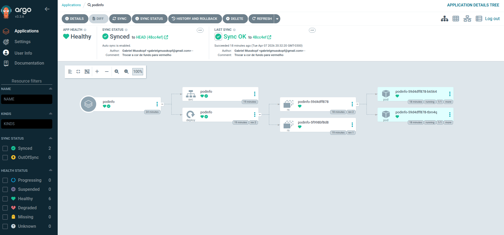
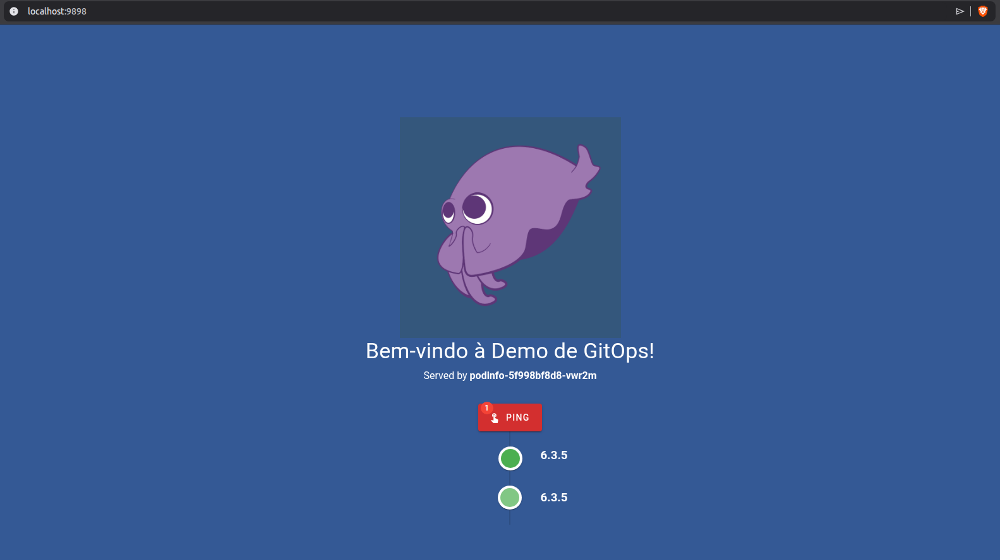

# Engenharia de software: Trabalho GitOps

Esse repositório visa demonstrar a utilização das práticas de GitOps. Para isso, iremos configurar um cluster local com ArgoCD, e adicionar uma aplicação existente nesse repositório.

## Quickstart

Para seguir essa demo, é preciso ter instalado [k3d](https://k3d.io/stable/) e [kubectl](http://kubernetes.io/pt-br/docs/tasks/tools/#kubectl).

**1. Criação do cluster**

Primeiro passo é criar o cluster
```bash
k3d cluster create es-demo
```
Aqui, o seu `kubectl` já deve ter sido configurado. Para testar execute
```bash
kubectl get nodes
```
Caso não funcione, veja se as informações do cluster foram adicionadas no `~/.kube/config` ou se existe a variável de ambiente `KUBECONFIG`. Veja mais na documentação o `kubeconfig` e/ou `k3d`.

**2. Criar namespace para a aplicação**

A aplicação irá ficar isolada no seu próprio namespace `dev`

```bash
kubectl create namespace dev
```

**3. Instalando ArgoCD**

Agora iremos instalar o ArgoCD no cluster. Aqui criamos um namespace para os recursos do serviço, instalamos usando um manifesto disponibilizado pelo time do ArgoCD, obtemos a senha inial do usuário `admin`, e fazemos um `port-forward` para acessar a UI.

```bash
# Instalando ArgoCD
kubectl create namespace argocd
kubectl apply -n argocd --server-side --force-conflicts -f https://raw.githubusercontent.com/argoproj/argo-cd/stable/manifests/install.yaml
# Obtendo senha do usuário admin
kubectl -n argocd get secret argocd-initial-admin-secret -o jsonpath="{.data.password}" | base64 --decode
# Port forward para acessar a UI do ArgoCD
kubectl port-forward svc/argocd-server -n argocd 8080:443
```

Agora acessando http://localhost:8080 e entrando com o usuário `admin` e a senha obtida na etapa anterior, deve ser possível acessar a UI.

**4. Adicionar a aplicação podinfo para o ArgoCD gerenciar***

Iremos descrever como criar a aplicação via UI do ArgoCD, porém o mesmo é possível via terminal. Com a UI aberta, vá em `+ NEW APP` e crie um app com:
- **Application Name**: podinfo
- **Project Name**: default
- **Sync Policy**: Automatic
- **Repository URL**: https://github.com/gabrielmusskopf/eng-software-t1
- **Path**: podinfo
- **Destionation**: https://kubernetes.default.svc
- **Namespace**: dev

Se a aplicação foi criada com sincronismo automático, após finalizar a criação já deve ser possível visualizar os recursos criados e o status de sincronismo como sucesso.



Para acessar a aplicação, precisamos fazer um forward do serviço
```bash
kubectl port-forward svc/podinfo -n dev 9898:9898
```
Agora, acesse http://localhost:9898



## Demostração

Para ver o sincronismo na prática, mude a cor de fundo
```yaml
# podinfo/deployment.yml
apiVersion: apps/v1
kind: Deployment
metadata:
  name: podinfo
  labels:
    app: podinfo
spec:
  replicas: 2
  selector:
    matchLabels:
      app: podinfo
  template:
    metadata:
      labels:
        app: podinfo
    spec:
      containers:
      - name: podinfod
        image: ghcr.io/stefanprodan/podinfo:6.3.5
        ports:
        - containerPort: 9898
        env:
        - name: PODINFO_UI_COLOR    # <--- Troque aqui
          # value: "#345995" 
          value: "#fb3640" 
```

Após a mudança, faça o commit e push. Observe a UI do ArgoCD e veja o sincronismo acontecendo.

:warning: Após o commit, o `port-forward` da aplicação vai ser cancelado. Para acessar a aplicação é preciso executar o comando novamente

## Encerrando

Para encerrar, basta remover o cluster
```bash
k3d cluster delete es-demo
```

## Demonstração em vídeo
[](https://youtu.be/RCxLAXtCY2s)
